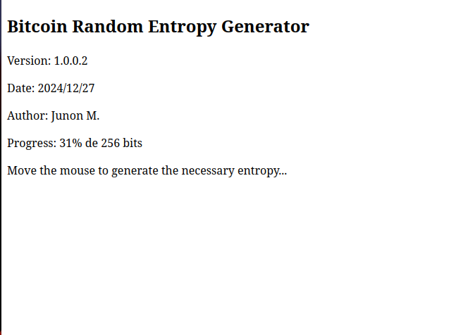

# Bitcoin Random Entropy Generator

## Description

- Generate Bitcoin private key entropy based Mouse movements and current system date.

## Requirements

- Web Browser with Javascript.

---

## Features

- Completely offline! does not depend on the internet!
- It also runs on Linux Tails, or on any system that has a web browser and Javascript support.
- Strong security of private keys entropy with random 256 bit data.

---

## Installation

1. Download the repository.
2. Unzip the files in your preferred directory.

---

## interface

---

## Usage

1. Double click on the `index.html` file, it will open in your computer's default browser.
2. Move the mouse pointer unpredictably for a few seconds until the private key entropy is generated.
3. If you need to generate another private key entropy, just refresh the page (F5) and move the mouse pointer again.
4. Copy the generated entropy to Ian Coleman's offline page to generate your private key.

---

## Author

- **Junon M.**  
  Contact: [junon10@tutamail.com](mailto:junon10@tutamail.com)

## Changelog

| Version | Date        | Changes Made              |
|---------|-------------|---------------------------|
| 1.0.0.0 | 2024/12/25  | Initial commit.           |
| 1.0.0.2 | 2024/12/27  | improvement in the generation of random numbers |

---

## License

- GPLv3

---

## Repository

[https://github.com/junon10/bitcoin-random-entropy-generator](https://github.com/junon10/bitcoin-random-entropy-generator)

## Contributions

Contributions are welcome! Feel free to fork the repository and submit pull requests with your improvements.

